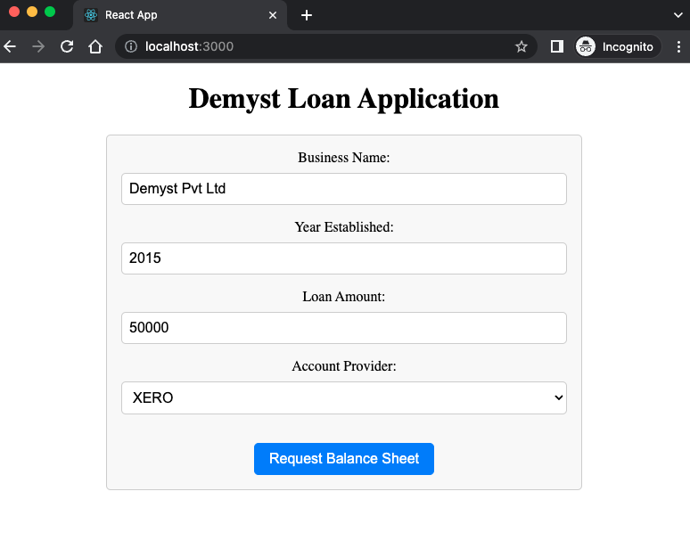
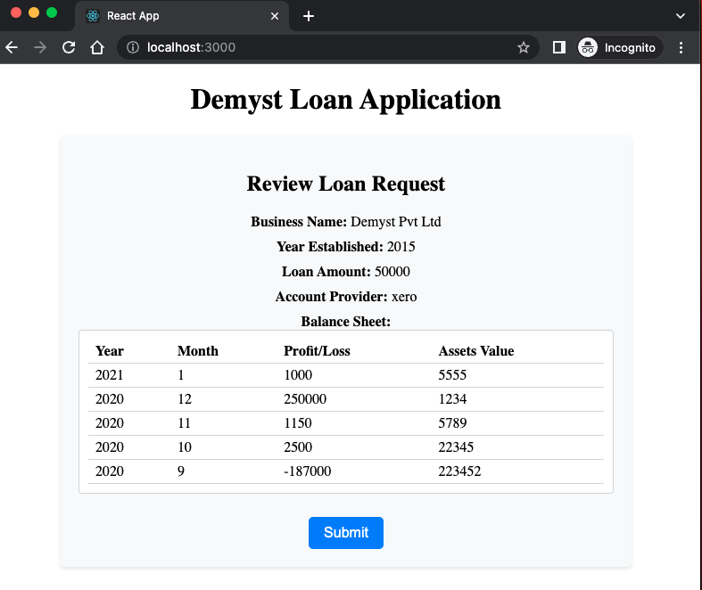
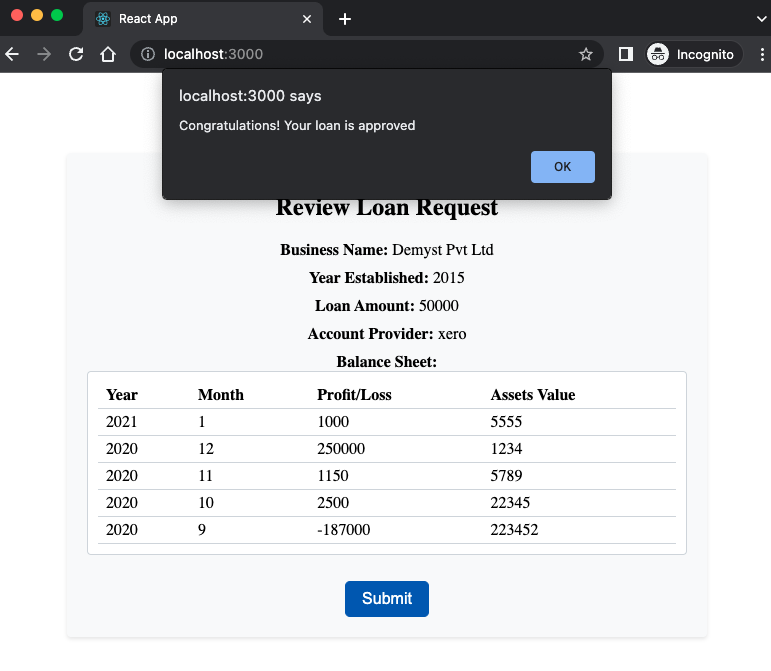

# Demyst Loan App

The project is divided into 2 projects for FE and BE respectively. They both have their respective README with instructions for running them. Both FE and BE run their individual servers.

I've dockerised the BE app only to show my knowledge.

## Tech Stack -
1. Node.js
2. Express.js
2. React.js
3. HTML/CSS

## Prerequisites for running the app locally -
1. Node.js (Tested with latest v19.8.1)
2. NPM (Tested with v9.5.1)
3. Docker (Optional, if want to run the docker image)

## Judging Criterias Implemented -
1. Engineering principles & standards
    - Created a separate config file instead of hardcoding. This should ideally be populated by some external config management system like consul and vault.
    - Created a separate class/file for external services (Xero, decisionService etc) so that their respective configuration can be defined there.
    - Create an abstraction layer accountingService so that the consumer doesn't care about whether interacting with Xero or MYOB.
    - Added a logger to log all requests in the BE. Ideally it would be better to also log requests from the Gateway or proxy in front of the app as they are more specialised and faster at it.
    - Properly bubble up the 500 errors using the `next` middleware so erros are not suppressed.
    - Handle CORS
    - Added FE validation
    - Added some BE validation
2. System extensibility & Scalability
    - It will be easier to add new accounting providers on both FE and BE. On FE, it can be a simple config change and no code change needed.
    - The BE is stateless and can be horizontally scaled assuming external dependencies can scale too.
    - Created a separeate router and controller per entity. Eventually it will be easy to extract any entity into its own microservice if needed.
3. Testability
    - Extracted simple non-business logic into external files and functions so that they can be unit tested individually.
    - All external IO is in separate files/functions and can be easily mocked while testing the API.
4. Brevity and Simplicity
    - Used Javascript as the project is simple and small.
    - Has a very clear directory structure and easy for a new dev to go in and make changes.

## Future improvements -
1. Engineering principles & standards
    - Create a separate config file for various environments.
    - Add a docker-compose for ease of local testing to make all the external dependencies available.
    - Add proper authentication and authorization checks. The authentication could also be handled by the gateway. It could be implemented using JWT.
    - Add a linting config for standardisation which will make it easier for multiple devs working on the same codebase.
    - Add BE validation for the APIs.
    - Add a CI/CD pipeline config
    - Add API documentation using 
2. System extensibility & Scalability
    - Move to Typescript if its a bigger project or has multiple devs working on it.
    - Serve the FE app as static files using a CDN
    - If the balance sheet is too large, think about streaming it as it can consume lots of memory.
3. Testability
    - Add unit tests
    - Add integration tests
    - Utilise a mocking library
    - Parellises the test to make the CI pipeline faster
4. Brevity and Simplicity

## Images of the flow -
1. The user is presented with the form

2. After fetching the balance sheet, the user can review it

3. The user can submit the loan request and find the result
